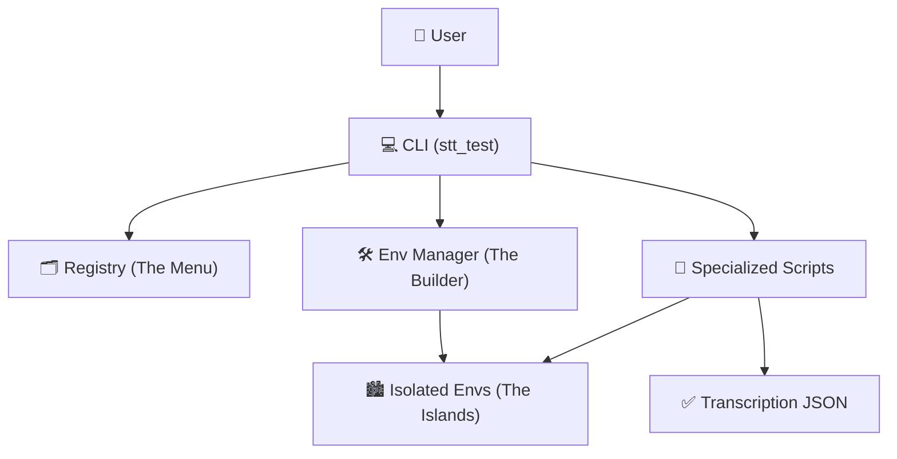

# 🎙️ voice-assistant: Vietnamese ASR & TTS Benchmarking Suite

A high-performance CLI tool for benchmarking the accuracy and speed (RTF) of leading Vietnamese Automatic Speech Recognition (ASR) and Text-to-Speech (TTS) models on your own hardware.

**Three benchmarking suites in one project:**
- 🎤 **ASR (Speech-to-Text)** - Benchmark transcription models
- 🔊 **TTS (Text-to-Speech)** - Benchmark voice synthesis models
- 🎯 **VAD (Voice Activity Detection)** - Detect and segment speech

---

## 🌟 Big Picture
Running multiple AI models like **Parakeet**, **Whisper**, and **UniASR** in a single Python environment is a recipe for "Dependency Hell." Different models often require conflicting versions of libraries like `torch` or `transformers`.

This project solves that by using an **Isolated Environment Architecture**. Every model lives on its own "private island" (Virtual Environment), and a central orchestrator manages them.

---

## 🏗️ Architecture & Design Patterns

We follow several industry-standard design patterns to keep the code clean and maintainable.

### 1. The Registry Pattern
**Pattern Name:** Registry  
**One-Line ELI5:** A centralized "Yellow Pages" for all available models.  
**Why Here:** Instead of hard-coding model logic everywhere, we defined all models in `stt_test/registry.py`. The CLI simply "looks up" a model by name to find its requirements and scripts.  
**Real Analogy:** A **Restaurant Menu**. You don't need to know how the kitchen makes 5 different dishes; you just point to the one you want on the menu.

### 2. The Isolation Pattern (Sandboxing)
**Pattern Name:** Isolation / Sandboxing  
**One-Line ELI5:** Giving every "toy" its own box so they don't fight over the same space.  
**Why Here:** AI libraries are massive and often incompatible. Keeping each model in its own virtual environment ensures that installing `nemo-toolkit` (for Parakeet) won't break `funasr` (for UniASR).  
**Real Analogy:** **Charging Cables**. Instead of trying to find one cable that fits 5 different phones, you give each phone its own matching cable in its own drawer.

### 📜 System Flow


---

## 🚀 Getting Started

### Prerequisites
1. **Python 3.10+**
2. **uv** (Recommended): `pip install uv`
   - > **Junior tip:** `uv` is a blazingly fast Python package manager. It's often 10x–100x faster than standard `pip` because it uses a global cache and smart linking.

### Installation
For a **detailed step-by-step tutorial**, please see our [Installation Guide](docs/installation-guide.md).

1. Clone the repository:
   ```bash
   git clone <repo-url>
   cd voice-assistant
   ```
2. Create the main environment and install the CLI:
   ```bash
   uv venv
   source .venv/bin/activate  # On Windows: .venv\Scripts\activate
   uv pip install -e .
   ```

### Usage
The tool is accessible via the `stt-test` (or `python -m stt_test`) command.

#### 1. List Available Models
See which models are ready to use.
```bash
python -m stt_test list
```

#### 2. Setup a Model
Create the isolated environment for a specific model (e.g., Whisper Turbo).
```bash
python -m stt_test setup whisper-turbo
```
*To set up all models at once, use:* `python -m stt_test setup --all`

#### 4. Run the Benchmark
Compare all models on the same audio file to see who is fastest and most accurate.
```bash
python -m stt_test benchmark test.wav
```

---

## 🔊 TTS Benchmarking (Text-to-Speech)

Benchmark Vietnamese voice synthesis models with quality metrics.

### Latest Benchmark Results

See [TTS Benchmark Results](docs/tts-benchmark-results.md) for detailed results.

**Real-Time Performance (Inference Only):**

| Model | RTF | Real-time | Speed | Quality |
|-------|-----|-----------|-------|---------|
| **vietts** (MMS TTS) | **0.02** | YES | **49x** | Good |
| **vietneu-tts** | **0.68** | YES | **1.5x** | Better |

**Note:** Both models run in real-time on GPU! The previous benchmarks included model loading time.

### Available Models

| Model | Description | Speaker Support | Status |
|-------|-------------|-----------------|--------|
| **vietts** | Facebook MMS VITS | No | ✅ Ready |
| **xtts-v2** | Coqui XTTS-v2 | Yes (voice cloning) | ⚠️ Fallback |
| **gpt-sovits** | GPT-SoVITS | Yes (few-shot) | ⚠️ Fallback |
| **vits-vi** | VITS Vietnamese (MMS) | No | ✅ Ready |
| **vietneu-tts** | VieNeu-TTS | Yes (instant cloning) | ✅ Ready |

**Notes:**
- ⚠️ xtts-v2 and gpt-sovits use MMS TTS fallback (Vietnamese) - full models require additional setup
- ✅ vietneu-tts requires Python 3.10+ (install via pyenv-win)

### Commands

#### List Available TTS Models
```bash
python -m tts_test list
```

#### Setup a TTS Model
```bash
python -m tts_test setup vietts
# Or setup all: python -m tts_test setup --all
```

#### Synthesize Text (Single Model)
```bash
python -m tts_test synthesize vietts "Xin chào thế giới"
```

#### Benchmark All Models
```bash
python -m tts_test benchmark "Xin chào, đây là bài kiểm tra giọng nói tiếng Việt."
```

#### Batch Benchmark (Multiple Texts)
```bash
python -m tts_test batch-benchmark ./test_texts/
```

### TTS Metrics

| Metric | Description | Good Value |
|--------|-------------|------------|
| **RTF** | Real Time Factor (speed) | < 1.0 |
| **MOS** | Mean Opinion Score (predicted quality) | > 3.5 |
| **PESQ** | Perceptual Speech Quality (requires reference) | > 3.0 |
| **STOI** | Speech Intelligibility (requires reference) | > 0.8 |

---

## 🎯 VAD (Voice Activity Detection)

Detect speech segments, trim silence, and segment audio files using Silero VAD.

### Features

- **Speech Detection:** Find all speech segments with precise timestamps
- **Silence Trimming:** Remove silence from recordings automatically
- **Audio Segmentation:** Split long audio into individual speech segments
- **Real-time Processing:** RTF < 0.01 (100x faster than real-time)
- **Language Agnostic:** Works on audio patterns, not language-specific

### Available Models

| Model | Description | Status |
|-------|-------------|--------|
| **silero-vad** | Silero VAD (language-agnostic) | ✅ Ready |

### Commands

#### List Available VAD Models
```bash
python -m vad_test list
```

#### Setup VAD Model
```bash
python -m vad_test setup silero-vad
```

#### Detect Speech Segments
```bash
python -m vad_test detect audio.wav
# With JSON output: python -m vad_test detect audio.wav -o results.json
```

#### Trim Silence
```bash
python -m vad_test trim audio.wav -o trimmed.wav
```

#### Segment Audio
```bash
python -m vad_test segment audio.wav -o ./segments/
```

#### Benchmark Performance
```bash
python -m vad_test benchmark audio.wav
```

### VAD Metrics

| Metric | Description | Good Value |
|--------|-------------|------------|
| **RTF** | Real Time Factor (speed) | < 0.1 |
| **Speech Ratio** | % of audio that is speech | Varies |
| **Segments** | Number of speech segments | Varies |

### Use Cases

1. **Pre-processing for ASR:** Trim silence before transcription for faster, more accurate results
2. **Voice Assistant:** Real-time speech detection for auto start/stop recording
3. **Audio Analysis:** Segment long recordings into individual utterances
4. **Dataset Cleaning:** Remove silence from training data

---

## 🧪 Annotated Decisions

### Why separate `run_<model>.py` scripts?
We don't "import" models directly into the main CLI. Instead, we spawn a separate Python process to run a script (like `run_whisper_turbo.py`).
- **Reason:** Many models perform global library initialization (like loggers or CUDA memory allocation) that can "poison" the environment for other models. A fresh process ensures a clean slate every time.

### Why UniASR instead of SenseVoice?
During development, we found `SenseVoiceSmall` had limited language support for Vietnamese compared to official specialized models. We pivoted to **UniASR Vietnamese** to ensure the highest possible accuracy for our specific use case.

---

## 📂 Project Structure
- `stt_test/`: Main package containing the ASR CLI, Registry, and Environment Manager.
- `stt_test/scripts/`: Specialized Python scripts that run inside isolated environments.
- `tts_test/`: Main package containing the TTS CLI, Registry, Environment Manager, and Audio Quality metrics.
- `tts_test/scripts/`: TTS inference scripts for each model.
- `vad_test/`: Main package containing the VAD CLI, Registry, Environment Manager, and Streaming VAD.
- `vad_test/scripts/`: VAD inference scripts for speech detection.
- `envs/`: (Generated) Directory where the model-specific virtual environments are stored.
  - `envs/tts/`: TTS-specific virtual environments.
  - `envs/vad/`: VAD-specific virtual environments.
- `docs/`: Technical deep-dives and post-mortems.
- `plans/`: Implementation roadmaps for future features.

---

## 📈 Industry Metrics: RTF
**Real Time Factor (RTF)** is our primary speed metric. 
- **RTF 1.0** = 1 second of audio takes 1 second to process.
- **RTF 0.05** = 1 second of audio takes 0.05 seconds (blazing fast!).
- **Goal:** We aim for an RTF below **0.2** to ensure the future Voice Assistant feels responsive and "live."
