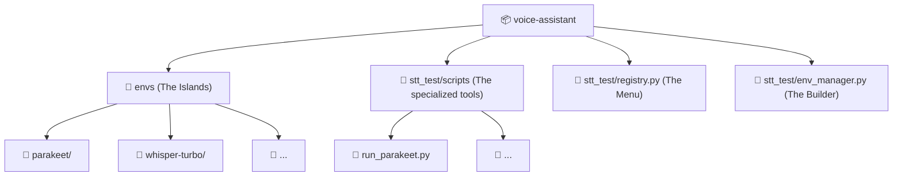

# ASR Model Environment Architecture

## 🌟 Big Picture
Running multiple AI models (Parakeet, Moonshine, Qwen3, UniASR, Whisper) in a single Python environment is often a nightmare of dependency conflicts—one model needs `torch 2.1`, another needs `torch 2.6`, and several have conflicting versions of `transformers` or `numpy`.

To solve this, we used an **Isolated Environment Architecture**. Each model lives in its own "private island" (Virtual Environment), and we communicate with them via a central "Orchestrator."

---

## 🛠️ Design Patterns Used

### 1. The Registry Pattern
**Pattern Name:** Registry
**One-Line ELI5:** A centralized "Yellow Pages" for all available tools (models).
**Why Here:** Instead of hard-coding model setups in the CLI, we put all configurations in `stt_test/registry.py`. The system just looks up the name (e.g., "whisper-turbo") to find its requirements.
**Real Analogy:** A **Restaurant Menu**. You don't need to know how the kitchen makes 5 different dishes; you just point to the one you want on the menu.

### 2. The Isolation Pattern (Sandboxing)
**Pattern Name:** Isolation / Sandboxing
**One-Line ELI5:** Giving every toy its own box so they don't fight over the same space.
**Why Here:** Models like `nemo-toolkit` (Parakeet) and `funasr` (UniASR) have very complex, non-standard dependencies. Keeping them separate avoids "DLL Hell" and version conflicts.
**Real Analogy:** **Charging Cables**. Instead of trying to find one cable that fits 5 different phones (impossible!), we just give each phone its own matching cable in its own drawer.

### 3. The Template Method Pattern
**Pattern Name:** Template Method
**One-Line ELI5:** Defining a fixed "workflow" where the specific details change but the steps are the same.
**Why Here:** Every model in our system follows the same 3 steps: 
1. `setup` (Create venv + install packages)
2. `transcribe` (Run a script and get JSON back)
3. `benchmark` (Collect stats)
**Real Analogy:** **Baking Cookies**. The *steps* are always the same (Prep -> Bake -> Cool), but the *ingredients* (chocolate vs. oatmeal) change depending on which "cookie" (model) you chose.

---

## 🏗️ File & Folder Structure

---

## 🧪 Annotated Decisions

### Why use `uv`?
> **Junior tip:** `uv` is an extremely fast Python package manager written in Rust. It's often 10x–100x faster than standard `pip`.

In this project, we have many environments. Reinstalling PyTorch + CUDA in 5 different folders would take hours with standard pip. With `uv`, it uses a **global cache** and **linking**, meaning it only downloads the 2 gigabytes of CUDA files ONCE and merely "links" them into each environment.

### Why separate `run_<model>.py` scripts?
We don't import model code into our main CLI. Instead, we run a separate Python process for each model. 
- **Reason:** Many models (like NeMo) perform "global initialization" (like setting up loggers) that can break other models. By spawning a fresh process, we ensure each model starts with a "clean slate."

---

## 🚀 How to Add a New Model

1. **Register it:** Add a new `ModelConfig` entry to `stt_test/registry.py` with the required `pip` packages.
2. **Standardize it:** Create a `stt_test/scripts/run_<name>.py` script. 
    - It MUST output a JSON string on the very last line of its stdout.
    - It SHOULD include a "warmup" call for accurate GPU benchmarking.
3. **Build it:** Run `python -m stt_test setup <name>`.
4. **Use it:** Run `python -m stt_test benchmark test.wav`.
