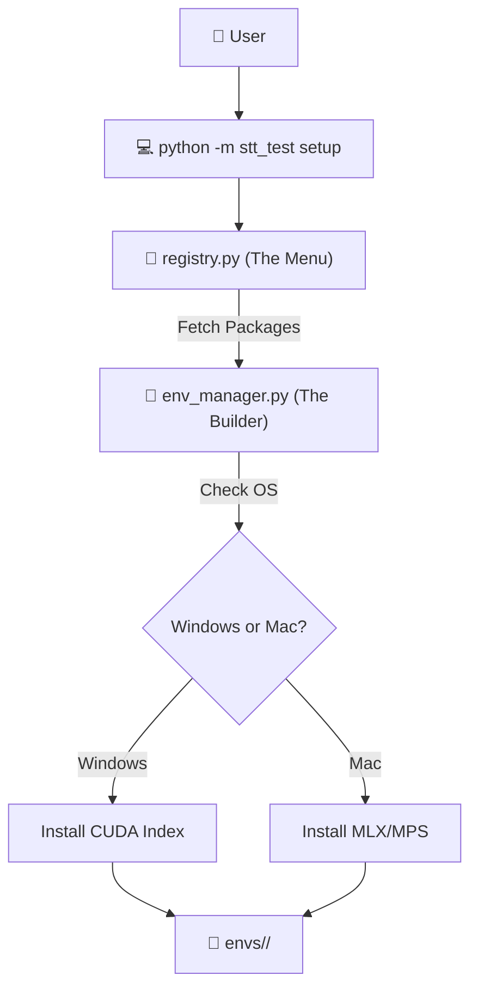

# ASR Installation Guide

## 🌟 Big Picture
Setting up AI models can be like trying to assemble 5 different puzzles on the same table—the pieces get mixed up! In this project, we use **Isolated Environments**. This tutorial will show you how to create a dedicated "table" (Virtual Environment) for each ASR model with just one command.

---

## 🛠️ Design Patterns in Setup

### 1. The Strategy Pattern (Platform Detection)
**Pattern Name:** Strategy
**One-Line ELI5:** Choosing the best "game plan" based on your situation.
**Why Here:** The setup script automatically detects if you have an NVIDIA GPU (Windows) or a Mac Mini. It then chooses the best "strategy" (CUDA vs. MPS/MLX) for installing the model.
**Real Analogy:** **Traveling.** If it's raining, your strategy is to take an umbrella. If it's sunny, you take sunglasses. The goal (traveling) is the same, but the *way* you do it changes.

---

## 🏗️ Installation Flow



---

## 🚀 Step 1: Prerequisites

Before you start, make sure you have:
1.  **Python 3.10+** installed.
2.  **uv** (Highly Recommended): This keeps the setup **10x faster**.
    - **Windows:** `powershell -c "irm https://astral.sh/uv/install.ps1 | iex"`
    - **Mac:** `curl -LsSf https://astral.sh/uv/install.sh | sh`
3.  **FFmpeg:** Needed for processing audio files.
    - **Windows:** `choco install ffmpeg` or download the `.exe`.
    - **Mac:** `brew install ffmpeg`.

---

## 🚀 Step 2: Creating the Environments

We have built a simple CLI to handle the complex setup for you.

### To setup ALL models (Recommended):
```powershell
python -m stt_test setup all
```

### To setup a specific model:
```powershell
python -m stt_test setup whisper-turbo
# or
python -m stt_test setup parakeet
```

> **Junior tip:** When you run this, you'll see a folder named `envs/` appear in your project. This is where all the heavy model library files live. 

---

## 🚀 Step 3: Verifying the Setup

Once the setup is done, you can verify everything is working by running a benchmark:

```powershell
python -m stt_test benchmark test.wav
```

If you see a table with "✅ Yes" in the "Real-time?" column, your environments are ready for prime time!

---

## ⚠️ Common Troubleshooting

### "editdistance" Failed on Windows
We have already fixed this using a **Dummy Build** pattern. If you see errors related to `editdistance`, just ensure the `dummy_editdistance/` folder exists and our orchestrator will use it to bypass the C++ requirement.

### "No CUDA found" (Windows)
Ensure you have the latest **NVIDIA Drivers** installed. Our setup script will try to install `torch+cu124` automatically, but it needs your system drivers to be ready.

### "MLX not found" (Mac)
If you are on a Mac Mini, ensure you are using an **Apple Silicon (M1/M2/M3)** model. Standard Intel Macs do not support the `mlx` acceleration.
